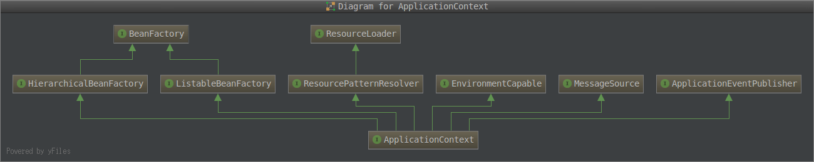

Spring IoC
---

Spring models 概览


Spring Framework 第一次发布是在 2004 年。Spring 2.0 支持 XML 命名空间和 AspectJ；Spring 2.5 支持注解驱动；Spring 3.0 提供了基于 Java 5+ 更强大的API，如 `@Configuration` 注解；Spring 4.0 支持 Java 8 语法。

`BeanFactory` 接口提供了管理 Bean 的高级配置。`ApplicationContext` 是 `BeanFactory` 的子接口，集成了 Spring AOP、消息资源处理、Spring Event、应用层特定上下文如 `WebApplicationContext`。简单地说，`BeanFactory` 提供了框架级配置和基础功能，`ApplicationContext` 则添加了更多的企业开发级功能。



`org.springframework.context.ApplicationContext` 接口代表 Spring IoC 容器，负责实例化、配置、组装容器中的 Bean。容器通过元数据 (XML,Java annotations,Java code) 描述 Bean 的实例化、配置和组装 Bean。

IoC 容器的元数据配置三种方式：
1. 传统的基于 XML 方式
2. `@Component` + `@Controller` + `@Service` + `@Repository`
3. `@Configuration` + `@ComponentScan` + `@Bean` + `@Import` + `@DependsOn`

XML-based 配置实例如下，更多配置请见 [官方文档](http://docs.spring.io/spring/docs/current/spring-framework-reference/htmlsingle/#beans-factory-metadata)。
```xml
<?xml version="1.0" encoding="UTF-8"?>
<beans xmlns="http://www.springframework.org/schema/beans"
    xmlns:xsi="http://www.w3.org/2001/XMLSchema-instance"
    xsi:schemaLocation="http://www.springframework.org/schema/beans
        http://www.springframework.org/schema/beans/spring-beans.xsd">

    <bean id="..." class="...">
        <!-- collaborators and configuration for this bean go here -->
    </bean>

    <bean id="..." class="...">
        <!-- collaborators and configuration for this bean go here -->
    </bean>

    <!-- more bean definitions go here -->

</beans>
```

Spring 建议在 `<import/>` 标签中使用相对路径组合外部 XML 配置文件，并且不推荐使用 `../` 和 `classpath:...` 方式。

在容器中，Bean 代表的是 `BeanDefinition` 对象，包含了以下元数据：
* Bean 类的全限定名
* Bean 在容器中的行为的配置元素，如 `scope`、`lifecycle`
* Bean 与其它 Bean 之间的引用
* 其它创建新对象时的配置项，如连接池的连接数

额外的 `BeanDefinition` 可以通过 `BeanDefinitionRegistry` 的 `registerBeanDefinition()` 和 `registerSingleton()` 注册。`BeanDefinitionRegistry` 可以通过应用中的 ApplicationContext  `getBeanFactory()` 获得。

Table 7.1. The bean definition
Property | Explained in ...
--- | ---
class | Section 7.3.2, “Instantiating beans”
name | Section 7.3.1, “Naming beans” 
scope | Section 7.5, “Bean scopes”
constructor arguments | Section 7.4.1, “Dependency Injection”
properties | Section 7.4.1, “Dependency Injection”
autowiring mode | Section 7.4.5, “Autowiring collaborators”
lazy-initialization mode | Section 7.4.4, “Lazy-initialized beans”
initialization method | the section called “Initialization callbacks”
destruction method | the section called “Destruction callbacks”

