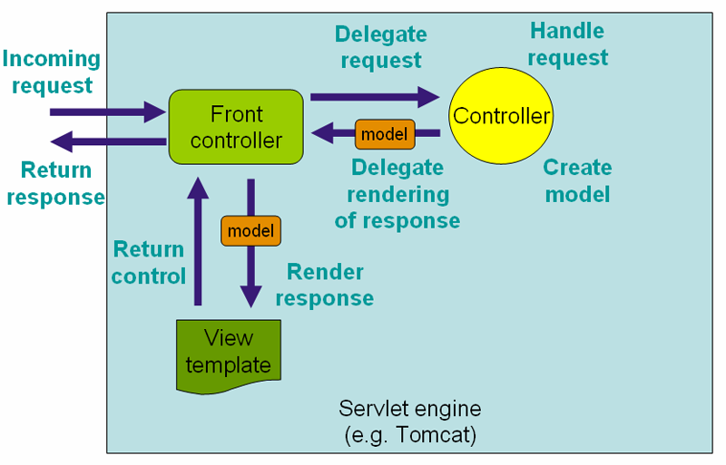

Spring MVC
---

# Web MVC framework
Spring MVC 与其它 MVC 框架一样，以请求为驱动，围绕一个核心 Servlet 设计，将请求发送给控制器，并提供一些促进 Web 应用开发的功能。Spring MVC 的 `DispatcherServlet` 的请求处理工作流程如下图所示：



`DispatcherServlet` 实际上是一个 `Servlet`，需要使用 URL 映射请求至 `DispatcherServlet`处理。Java EE Servlet 3.0+ 配置如下：
```java
public class MyWebApplicationInitializer implements WebApplicationInitializer {

    @Override
    public void onStartup(ServletContext container) {
        ServletRegistration.Dynamic registration = container.addServlet("example", new DispatcherServlet());
        registration.setLoadOnStartup(1);
        registration.addMapping("/example/*");
    }

}
```
上例中，所有以 `/example` 开始的请求会由名为 `example` 的 `DispatcherServlet` 处理。

`WebApplicationInitializer` 是由 Spring MVC 提供的接口，可确保基于代码的配置被检测并自动用于初始化任何 Servlet 3.0+ 容器。`AbstractAnnotationConfigDispatcherServletInitializer` 是实现了这个接口的抽象类，可以通过指定 Servlet 映射类和配置类，来更简单地注册 `DispatcherServlet`。

传统 XML 方式的 Java EE Servlet 配置如下：
```xml
<web-app>
    <servlet>
        <servlet-name>example</servlet-name>
        <servlet-class>org.springframework.web.servlet.DispatcherServlet</servlet-class>
        <load-on-startup>1</load-on-startup>
    </servlet>

    <servlet-mapping>
        <servlet-name>example</servlet-name>
        <url-pattern>/example/*</url-pattern>
    </servlet-mapping>

</web-app>
```

在 Web MVC 框架中，每个 `DispatcherServlet` 都有它自己的 `WebApplicationContext`，它继承了在根 `WebApplicationContext` 中定义的所有 bean。根 `WebApplicationContext` 包含了所有在其它上下文和 Servlet 实例之间共享的基本 bean。这些 bean 可以在特定的 servlet 范围内被覆盖，可以在给定的 Servlet 实例中定义新的指定范围的 bean。


初始化 `DispatcherServlet` 时候，Spring MVC 会在 `WEB-INF` 目录查找名为 [servlet-name]-servlet.xml 的配置文件，并创建其中定义的 bean。可以通过设置一个 contextConfigLocation 参数来配置此选项，如：
```xml
<web-app>
    <context-param>
        <param-name>contextConfigLocation</param-name>
        <param-value>/WEB-INF/root-context.xml</param-value>
    </context-param>
    <servlet>
        <servlet-name>dispatcher</servlet-name>
        <servlet-class>org.springframework.web.servlet.DispatcherServlet</servlet-class>
        <init-param>
            <param-name>contextConfigLocation</param-name>
            <param-value></param-value>
        </init-param>
        <load-on-startup>1</load-on-startup>
    </servlet>
    <servlet-mapping>
        <servlet-name>dispatcher</servlet-name>
        <url-pattern>/*</url-pattern>
    </servlet-mapping>
    <listener>
        <listener-class>org.springframework.web.context.ContextLoaderListener</listener-class>
    </listener>
</web-app>
```

也可以通过代码实现相同的配置：
```java
public class GolfingWebAppInitializer extends AbstractAnnotationConfigDispatcherServletInitializer {

    @Override
    protected Class<?>[] getRootConfigClasses() {
        // GolfingAppConfig defines beans that would be in root-context.xml
        return new Class[] { GolfingAppConfig.class };
    }

    @Override
    protected Class<?>[] getServletConfigClasses() {
        // GolfingWebConfig defines beans that would be in golfing-servlet.xml
        return new Class[] { GolfingWebConfig.class };
    }

    @Override
    protected String[] getServletMappings() {
        return new String[] { "/golfing/*" };
    }

}
```


# View technologies

# Integrating with other web frameworks

# WebSocket Support